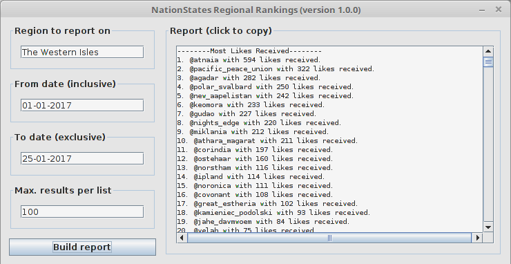

# NationStates Regional Rankings Application

This desktop application allows you to generate nation rankings based on a region's statistics, mostly pertaining to its message board. It only requires Java to be installed on your machine in order to run.

This application can generate the following rankings:
* The nations with the most message board likes received;
* The nations with the most message board likes given;
* The nations with the most message board posts made;
* The nations with the highest likes to message board posts ratios.

More rankings are bound to be added in the future. Suggestions are welcome.

This program uses my own [NationStates API Java Wrapper](https://github.com/Agadar/NationStates-api-java-wrapper) to communicate with the NationStates API.

## Screenshot

